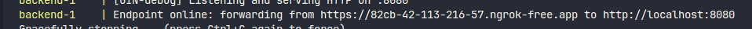
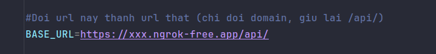

# ReSell

Ứng dụng đồ án cho môn SE114

| **MSSV** | **Họ và tên** |

|:------------:|:-------------------:|

| **23520790** | **Võ An Khôi** |

| **23520905** | **Võ Hồng Lương** |

| **23520819** | **Quách Gia Kiệt** |

| **23520887** | **Phạm Thành Long** |

  
<br>  
<br>  

# Hướng dẫn chạy source code
1.  Vào thư mục project:
```
cd ReSell
```

2. Chạy backend  + admin web 
   
```
docker compose up --build 
```
>[!NOTE]
> Phải đảm bảo các yêu cầu sau: 
>  - Docker engine đang chạy
> - Có file .env và firebase_secret.json trong project


3. Copy public url của backend (ở dòng cuối của log khi chạy docker compose), có dạng https://xxx.ngrok-free.app 
   
<br>
   


<br>

4. Vào Android Studio, mở file local.properties (trong folder Grade Scripts nếu chọn cách hiển thị Android), sau đó thêm dòng sau: 
```
BASE_URL=https://xxx.ngrok-free.app/api/
``` 


>[!NOTE]
> **Lưu ý:** Nhớ dùng url copy từ log


5. Build app Android là xài được  


<br>  
<br>

# Danh sách tính năng dự kiến

# 1. Admin

  

- Tạo danh mục sản phẩm (Danh mục sản phẩm gồm ID và tên)

- Kiểm duyệt bài đăng (tránh bán hàng giả, hàng cấm)

- Kiểm duyệt thông tin tài khoản (tránh tài khoản lừa đảo, giả mạo)

  

# 2. Người dùng

  

- Đăng ký và đăng nhập (Tài khoản lúc tạo chỉ cần tên đăng nhập, email, phone, mật khẩu)

- Một tài khoản có thể vừa mua, vừa bán

- Quản lý tài khoản ⇒ Muốn mua bán phải cung cấp thêm thông tin cá nhân:

- Họ và tên

- Ngày sinh

- Địa chỉ

- CCCD

- …

- Cài đặt giao diện:

- Light/dark mode

- Font size

- …

- Quản lý đơn hàng (đơn bán, đơn mua)

- Báo cáo người dùng/sản phẩm

  

## 2.1. Người bán

  

- Đăng, sửa, xóa tin rao bán

- 1 tin = 1 sản phẩm

- 1 tin gồm: tiêu đề, mô tả, hình ảnh, giá, danh mục, tình trạng,…

- Tạo ưu đãi

- Trao đổi với người mua

- Giao hàng cho người mua

- Cập nhật trạng thái đơn hàng

- Nhận tiền từ người mua khi hoàn thành đơn hàng

- Xem thống kê hoạt động (số lượt xem tin rao, tình trạng tin rao, số lượt theo dõi gian hàng, doanh thu ước tính, điểm uy tín)c

  

## 2.2. Người mua

  

- Duyệt, tìm kiếm, sắp xếp và lọc tin rao bán (Danh mục, khu vực, tầm giá, thời gian đăng)

- Xem tin bán

- Xem thông tin người bán

- Thêm vào giỏ hàng

- Liên lạc với người bán (nhắn tin, gọi điện)

- Đặt hàng

- 1 admin có thể có nhiều địa chỉ, có một địa chỉ mặc định

- Theo dõi đơn hàng

- Thanh toán (tiền mặt/ví)

- Theo dõi người bán (nhận thông báo khi người bán đăng tin mới)

- Đánh giá giao dịch

  

# 3. Chức năng khác

  

## 3.1. Nhắn tin

  

- Nhắn tin giữa người bán và người mua

  

## 3.3. Bảo mật

  

- Xác minh tài khoản (email, số điện thoại, CMND)
